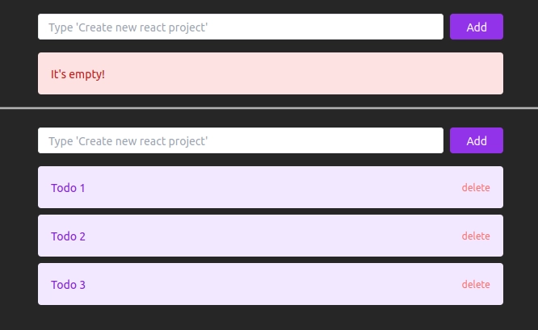

# Todo App

Simple todo app



## Usage

### npm
``` 
$ npm run dev
```
### pnpm

```
$ pnpm run dev
```

## Technologies I Learned and Used

* [pnpm](https://pnpm.io/)
    * install packages
    * add packages
    * run script
* [react](https://reactjs.org/)
    * jsx syntax
    * rendering html elements
    * state hook
    * handle form submit event
    * onClick functions
    * list an array via map function
* [tailwind](https://tailwindcss.com/)
    * install and init tailwind
    * use some class
    * set custom color classes
* [vite](https://vitejs.dev/)
    * create react project